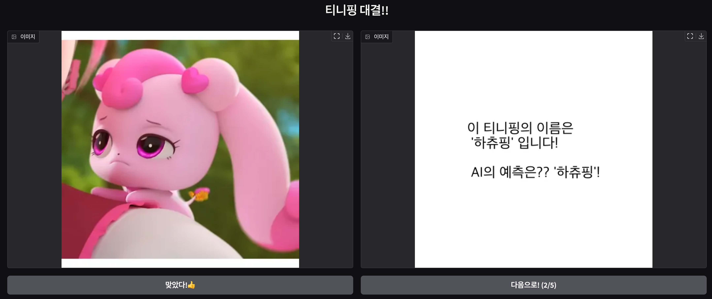

# AI 테크 리더 고모부가 조카와 티니핑 놀이를 하는 방법 

YouTube(TBU) | HuggingFace(TBU) | [Free E-Book](https://www.uppage.com/instmmismin/gradio-dist)



## 세팅 

- python : 3.12 
- roboflow==1.1.54
- gradio==5.16.0
- chardet==5.2.0

추가로 

- torch와 torchvision를 설치해야 함 
- 각자의 OS에 맞춰 다운로드 필요 [링크](https://pytorch.org/get-started/locally/)
- 버전 
    - torch : 2.6.0
    - torchvision : 0.21.0 

## 데이터 

```
python prepare_data.py
```
- 준비 사항으로 
    - roboflow api key를 준비해야 함 
    - 참고 : [링크](https://docs.roboflow.com/api-reference/authentication)

- 결과적으로 
    - '티니핑-6' 이라는 폴더 다운로드 
    - 학습용 dataset 폴더 생성 
        - 하위 폴더 : train (80%), validation (10%), test (10%)

## 추론 

```
python infer.py
```

## 학습 

```
CUDA_VISIBLE_DEVICES=0 python train.py
```

## app 

```
python app.py
```

## 참고 

- 활용 티니핑 데이터 : https://universe.roboflow.com/f22raptor/-ofkz6